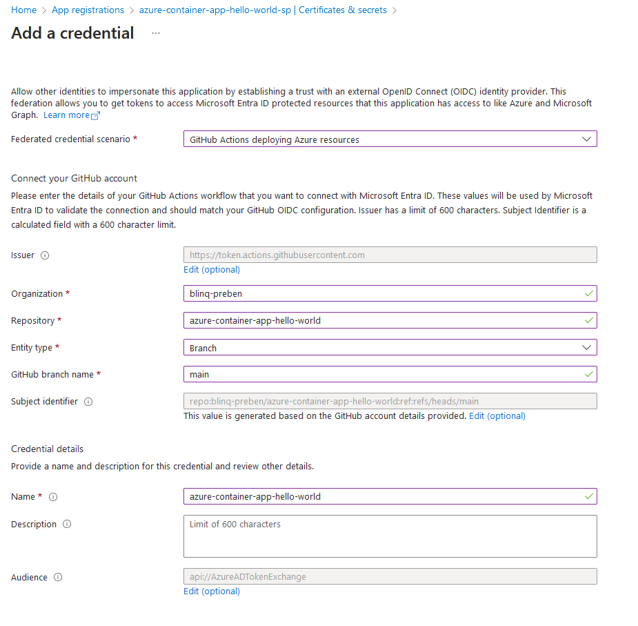

# azure-container-app-hello-world


1. Log into Docker Hub
   - Go to account settings and create a new access token
   - Go to the github repository => settings => secrets and variables and create:
     - DOCKERHUB_TOKEN  and paste the access token as the value
     - DOCKERHUB_USERNAME and set your Docker Hub username as the value 
     - Paste the token value in a notepad document (but don't save the document)   

2. Create a Dockerfile
    ```Dockerfile
    FROM python:3.11

    # Set the working directory to /app
    WORKDIR /app

    # Copy the current directory contents into the container at /app
    COPY . /app

    # Install any needed packages specified in requirements.txt
    RUN pip install --no-cache-dir -r requirements.txt

    # Expose port 80 to the outside world
    EXPOSE 80

    # Run when the container launches
    CMD ["python", "src/server.py",  "0.0.0.0:80"]
    ```

3. Create a docker image
    ```powershell
    docker build -t azure-container-app-hello-world .
    ```

4. Create a repository in Docker Hub

5. Login to Docker in the CLI
   ```powershell
   echo <DOCKERHUB_TOKEN> | docker login --username prebenh --password-stdin
   ```

6. Associate the Docker image with the repository
    ```powershell
    docker tag azure-container-app-hello-world prebenh/azure-container-app-hello-world:latest
    ```

7. Push the image to the Docker repository
    ```powershell
    docker push prebenh/azure-container-app-hello-world:latest
    ```

8. Create Azure resource group
    ```powershell
    az group create --name my-resource-group --location norwayeast
    ```

9. Download azure cli extension for creating container apps
    ```powershell
    az extension add --name containerapp --upgrade
    ```

10. Create the container app via the CLI
    ```powershell
    az containerapp up \
                --name azure-container-app-hello-world \
                --resource-group my-resource-group \
                --location norwayeast \
                --environment 'my-container-apps' \
                --image prebenh/azure-container-app-hello-world:latest \
                --target-port 80 \
                --ingress external \
                --query properties.configuration.ingress.fqdn
    ```

11. Create a Service Principal to allow GitHub actions to create/update the container app
    ```powershell
    az ad sp create-for-rbac --name azure-container-app-hello-world --role contributor \
    --scopes /subscriptions/<subscription-id>/resourceGroups/<resource-group> \
    --sdk-auth
    ```

12. Go to Azure => App registrations and find the service principal you just created
    a. Click on Certificate & secrets
    b. Click on Federated credentials
    c. Click on add credential - fill out like below



13. Create a folder structure like this in your project:
- .github
  - workflows
    - build-deploy.yml

The yml file should look like this: 
```yml
name: Deploy to Azure Container Registry
on:
  push:
    branches:
      - main

jobs:
  docker:
    runs-on: ubuntu-latest
    steps:
      - name: Checkout
        uses: actions/checkout@v3

      - name: Set up QEMU
        uses: docker/setup-qemu-action@v2

      - name: Set up Docker Buildx
        uses: docker/setup-buildx-action@v2

      - name: Login to Docker Hub
        uses: docker/login-action@v2
        with:
          username: ${{ secrets.DOCKERHUB_USERNAME }}
          password: ${{ secrets.DOCKERHUB_TOKEN }}

      - name: Build and push
        uses: docker/build-push-action@v4
        with:
          push: true
          context: .
          tags: prebenh/azure-container-app-hello-world:latest
  deploy-azure:
    needs: docker
    runs-on: ubuntu-latest
    steps:
      - name: 'Az CLI login'
        uses: azure/login@v1
        with:
          creds: '${{ secrets.AZURE_CREDENTIALS }}'

      - name: 'Run Azure CLI commands'
        run: |
          az containerapp up \
            --name azure-container-app-hello-world \
            --resource-group my-resource-group \
            --location norwayeast \
            --environment 'my-container-apps' \
            --image prebenh/azure-container-app-hello-world:latest \
            --target-port 80 \
            --ingress external \
            --query properties.configuration.ingress.fqdn
```

14. Commit and push your code. 
